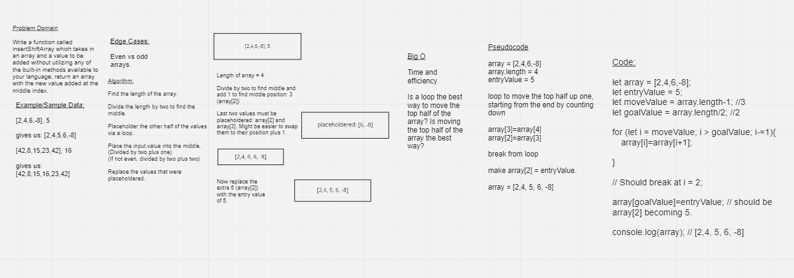

# Insert to Middle of an Array

Write a function called insertShiftArray which takes in an array and a value to be added. 

*Without utilizing any of the built-in methods available to your language, return an array with the new value added at the middle index.*

### Example/Sample Data:

[2,4,6,-8], 5 

gives us: [2,4,5,6,-8]

[42,8,15,23,42], 16

gives us: [42,8,15,16,23,42]

## Whiteboard Process

## Approach & Efficiency
The approach I took was to move up all the values from the "top" half of the existing array up one.

This requires a loop which may not be as efficient and could run into problems with odd numbered arrays.