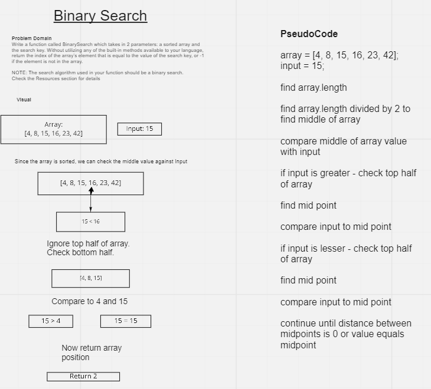

# Binary Search of Sorted Array
Write a function called BinarySearch which takes in 2 parameters: a sorted array and the search key. Without utilizing any of the built-in methods available to your language, return the index of the array’s element that is equal to the value of the search key, or -1 if the element is not in the array.

NOTE: The search algorithm used in your function should be a binary search.
Check the Resources section for details

Example: 

[4, 8, 15, 16, 23, 42], 15 

gives us 2 

[-131, -82, 0, 27, 42, 68, 179], 42	

gives us 4

[11, 22, 33, 44, 55, 66, 77], 90	

gives us -1

[1, 2, 3, 5, 6, 7], 4	

gives us -1

Binary Search Algorithm: https://en.wikipedia.org/wiki/Binary_search_algorithm

## Whiteboard Process

WhiteBoard Workflow: https://codefellows.github.io/common_curriculum/data_structures_and_algorithms/Whiteboard_Workflow.html

1. Problem Domain
2. Visual
3. Algorithm
4. Big O
5. Pseudocode
6. Code
7. Test

## Approach & Efficiency
This should require a while statement that continues until the distance between midpoints is 0.