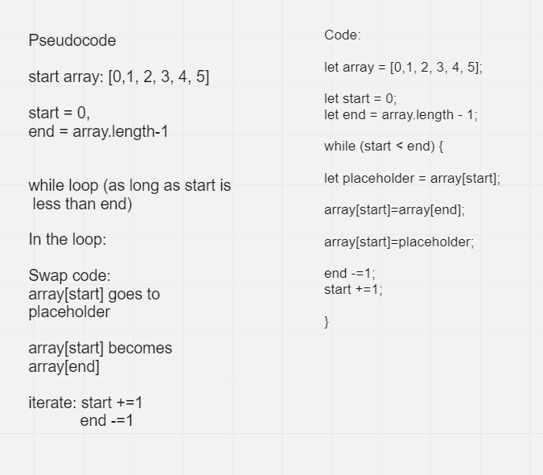

# Reverse an Array

*Write a function called reverseArray which takes an array as an argument. Without utilizing any of the built-in methods available to your language, return an array with elements in reversed order.*

What do I return?
- The same array?
- A new array?

What are the inputs and outputs?

Sample data:

[1, 2, 3, 4, 5, 6] should give [6, 5, 4, 3, 2, 1]

[89, 2354, 3546, 23, 10, -923, 823, -12] should give [-12, 823, -923, 10, 23, 3546, 2354, 89]

Any methods should be clean, reusable, abstract component parts to the challenge.

## Whiteboard Process

## Approach & Efficiency
I initially took this using the .push method and array.length but realized I was using 1) a new array and 2) utilizing a built in method.

Testing:

Should test with arrays that have an odd and even number of elements.

Length should not make a difference.

If array.length is not allowed as a language method, how would I find the length of the array?

Use a while loop that adds to a counter, go through the array until there is no value returned?