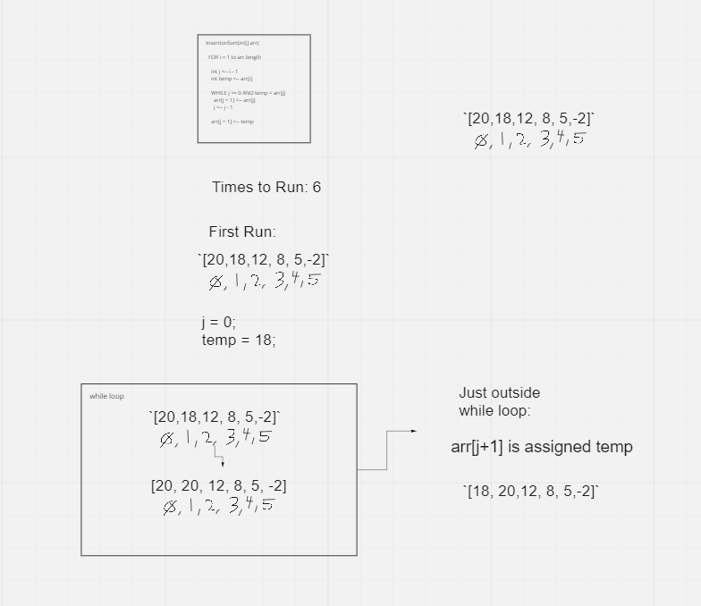

# Insertion Sort

# Challenge Summary
Review the pseudocode below, then trace the algorithm by stepping through the process with the provided sample array. Document your explanation by creating a blog article that shows the step-by-step output after each iteration through some sort of visual.

Once you are done with your article, code a working, tested implementation of Insertion Sort based on the pseudocode provided.


**Pseudocode**

```js
  InsertionSort(int[] arr)

    FOR i = 1 to arr.length

      int j <-- i - 1
      int temp <-- arr[i]

      WHILE j >= 0 AND temp < arr[j]
        arr[j + 1] <-- arr[j]
        j <-- j - 1

      arr[j + 1] <-- temp

```

## Sample Arrays

In your blog article, visually show the output of processing this input array:

`[8,4,23,42,16,15]`

For your own understanding, consider also stepping through these inputs:

Reverse Sorted: `[20,18,12,8,5,-2]`

Few uniques: `[5,12,7,5,5,7]`

Nearly-sorted: `[2,3,5,7,13,11]`

## Whiteboard Process


## Approach & Efficiency
O(n^2)

## Solution

Real Code

```js
function insertionSort(arr) {


for (let i = 1; i < arr.length; i+=1) {
    let j = i - 1;
    let temp = arr[i];
 
    while (j >= 0 && temp < arr[j]) {
        arr[j+1] = arr[j];
        j -= 1;
    }

    arr[j+1] = temp;

}

return arr;

}

```


## Written Trace

```js
`[20,18,12, 8, 5,-2]`

   0, 1, 2, 3, 4, 5

Verbal Description of First Run:

// For i = 1 to arr.length. 

This means 1 to 6

// int j is assigned i - 1, or 1 - 1

This means `j = 0` now.

// int temp is assigned arr[i]. 

Currently i is 1

This means `arr[i]` is `arr[1]`, which is `18`. `temp` is now `18`.

// while j >= 0 && temp < arr[j]

Right now `j` is `0` and `temp` is `18`. `arr[j]` is `20`

While condition is `TRUE`, so the interior will now run

- INTERIOR OF WHILE BELOW

// arr[j + 1] is assigned arr[j]

`arr[1]` is assigned `arr[0]`

This means `arr[1]` is now `20`

// j is assigned j -1

This means `j` is reduced by `1`. `j` is now 

- INTERIOR OF WHILE ABOVE

// arr[j+1] is assigned temp

arr[2] is now 18

```

## Credit

JavaScript Algorithms and Data Structures Masterclass
