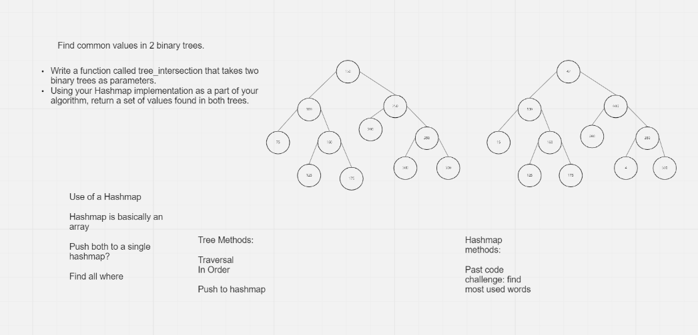

# Code Challenge 32: Tree Intersection

## Challenge Summary

Write a function called tree_intersection that takes two binary trees as parameters.

Using your Hashmap implementation as a part of your algorithm, return a set of values found in both trees.

## Whiteboard Process

## Approach & Efficiency
O(m * h)

m - number of nodes in first trees
h - height of second tree

## Solution
<!-- Show how to run your code, and examples of it in action -->

## Testing

“Happy Path” - Expected outcome
Expected failure
Edge Case (if applicable/obvious)

## Credit

jamiguel23

https://www.geeksforgeeks.org/print-common-nodes-in-two-binary-search-trees/

https://github.com/joric/interviewbit/blob/master/programming/random/common-nodes-in-two-binary-search-trees.md