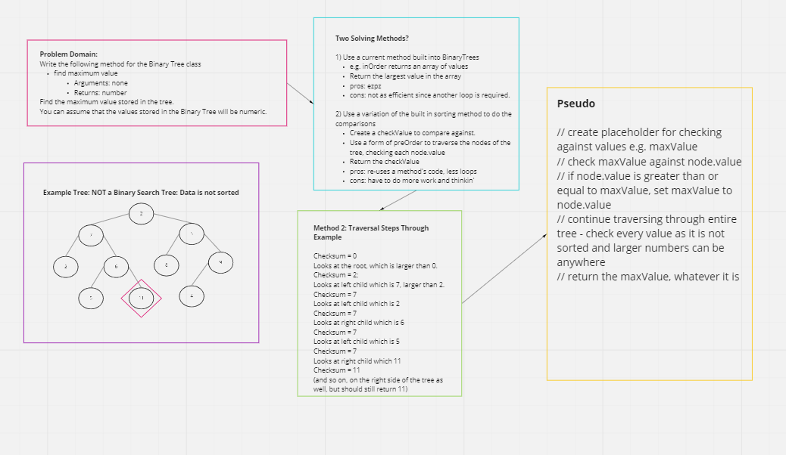

# Tree Max
Challenge Type: Extending an Implementation

Write the following method for the Binary Tree class

find maximum value
Arguments: none
Returns: number
Find the maximum value stored in the tree. You can assume that the values stored in the Binary Tree will be numeric.

## Whiteboard Process

## Approach & Efficiency
I am going to try and take an preOrder traversal method and modify it to check values. This increases efficiency as it doesn't require another loop if I simply used the traversal method to print out an array to check the max value.

## Solution

max-trees.js

## Structure and Testing