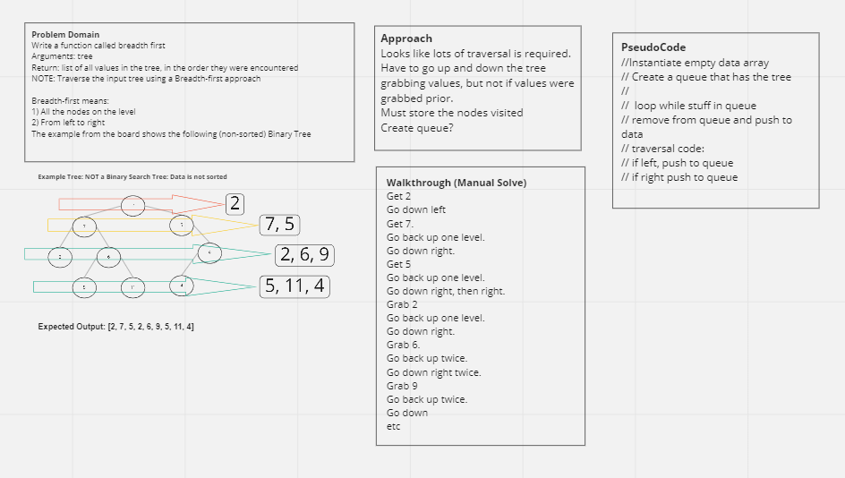

# tree-breadth-first
Write a function called breadth first
Arguments: tree
Return: list of all values in the tree, in the order they were encountered
NOTE: Traverse the input tree using a Breadth-first approach

Breadth-first means:

1) All the nodes on the level
2) From left to right

The example from the board shows the following (non-sorted) Binary Tree

            2
    7               5
2       6               9
    5       11      4

Output: [2,7,5,2,6,9,5,11,4]

## Whiteboard Process

## Approach & Efficiency
Time: 

Space: Linear? As long as the 

## Solution
<!-- Show how to run your code, and examples of it in action -->

## Credits

Udemy: JavaScript Algorithms and Data Structures Masterclass
by Colt Steele
