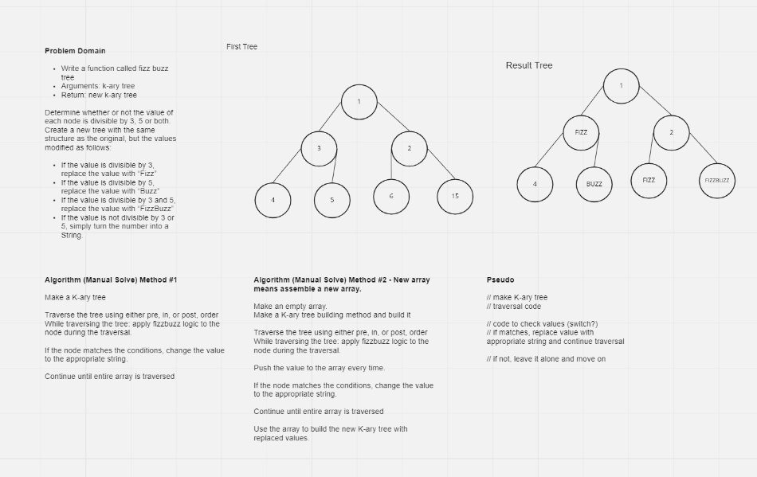

# tree-breadth-first
Conduct “FizzBuzz” on a k-ary tree while traversing through it to create a new tree.

Set the values of each of the new nodes depending on the corresponding node value in the source tree.

Write a function called fizz buzz tree
Arguments: k-ary tree
Return: new k-ary tree

Determine whether or not the value of each node is divisible by 3, 5 or both. 

Create a new tree with the same structure as the original, but the values modified as follows:

If the value is divisible by 3, replace the value with “Fizz”
If the value is divisible by 5, replace the value with “Buzz”
If the value is divisible by 3 and 5, replace the value with “FizzBuzz”
If the value is not divisible by 3 or 5, simply turn the number into a String.

## Whiteboard Process

## Approach & Efficiency

Space: Linear? As long as the 

## Solution
tree-fizz-buzz.js

## Credits

Udemy: JavaScript Algorithms and Data Structures Masterclass
by Colt Steele

https://www.geeksforgeeks.org/construct-full-k-ary-tree-preorder-traversal/