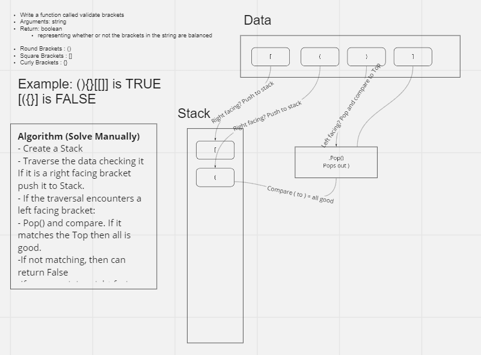
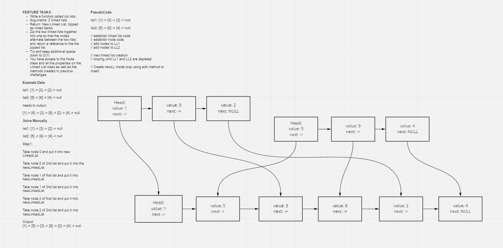
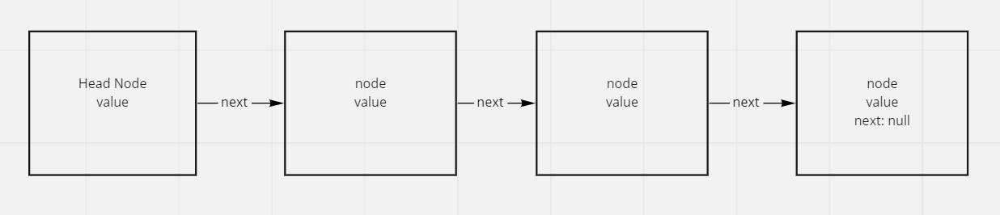

# Trees

https://codefellows.github.io/common_curriculum/data_structures_and_algorithms/Code_401/class-15/resources/Trees.html

## Challenge

**Node**

Create a Node class that has properties for the value stored in the node, the left child node, and the right child node.

**Binary Tree**

Create a Binary Tree class
Define a method for each of the depth first traversals:
pre order
in order
post order which returns an array of the values, ordered appropriately.

Any exceptions or errors that come from your code should be semantic, capture-able errors. For example, rather than a default error thrown by your language, your code should raise/throw a custom, semantic error that describes what went wrong in calling the methods you wrote for this lab.

**Binary Search Tree**

Create a Binary Search Tree class
This class should be a sub-class (or your languages equivalent) of the Binary Tree Class, with the following additional methods:
Add
Arguments: value
Return: nothing
Adds a new node with that value in the correct location in the binary search tree.
Contains
Argument: value
Returns: boolean indicating whether or not the value is in the tree at least once.

## Structure and Testing

Can successfully instantiate an empty tree
Can successfully instantiate a tree with a single root node
For a Binary Search Tree, can successfully add a left child and right child properly to a node
Can successfully return a collection from a preorder traversal
Can successfully return a collection from an inorder traversal
Can successfully return a collection from a postorder traversal
Returns false for the `contains` meethod, given an existing or non-existing node value.

## Approach & Efficiency
The big O for this is O(log(n))

## API

`preOrder` - goes through the tree in preOrder

`inOrder` - goes through the tree in inOrder

`postOrder` - goes through the tree in postOrder

`add(value)` - adds to the Binary Search Tree (should add in appropriate spot) please don't add a value already in the tree.

`contains(value)` - sees if the value exists in the tree by searching it going left or right depending on the start value. returns true or false.

## Credit

UDemy - JavaScript Algorithms and Data Structures Masterclass by Colt Steele

# Balanced Brackets

# Challenge Summary
Write a function called validate brackets
Arguments: string
Return: boolean
representing whether or not the brackets in the string are balanced

Round Brackets : ()
Square Brackets : []
Curly Brackets : {}

## Whiteboard Process

## Approach & Efficiency
Efficiency should be O(n) as there is a loop.

## Solution
Algorithm (Solve Manually)
- Create a Stack
- Traverse the data checking it
If it is a right facing bracket push it to Stack.
- If the traversal encounters a left facing bracket:
- Pop() and compare. If it matches the Top then all is good.
-If not matching, then can return False
-If any remaining right facing brackets then return False

## Credits:

Lots of algo help from: 

https://www.geeksforgeeks.org/check-for-balanced-parentheses-in-an-expression/

# Animal Shelter

# Challenge Summary
Create a class called AnimalShelter which holds only dogs and cats.
The shelter operates using a first-in, first-out approach.
Implement the following methods:
enqueue
Arguments: animal
animal can be either a dog or a cat object.
dequeue
Arguments: pref
pref can be either "dog" or "cat"
Return: either a dog or a cat, based on preference.
If pref is not "dog" or "cat" then return null.

## Whiteboard Process

## Approach & Efficiency
Approach: Throw whatever at the wall and see what sticks.

Efficiency: If it works, it's efficient.

## Solution
see: pseudoqueue.js

# PseudoQueue

# Challenge Summary
Create a new class called pseudo queue.
Do not use an existing Queue.
Instead, this PseudoQueue class will implement our standard queue interface (the two methods listed below),
Internally, utilize 2 Stack instances to create and manage the queue
Methods:
enqueue
Arguments: value
Inserts value into the PseudoQueue, using a first-in, first-out approach.
dequeue
Arguments: none
Extracts a value from the PseudoQueue, using a first-in, first-out approach.

NOTE: The Stack instances have only push, pop, and peek methods. You should use your own Stack implementation. Instantiate these Stack objects in your PseudoQueue constructor.

Example

enqueue(value)

Input: [10]->[15]->[20]
Args: 5
OutPut: [5]->[10]->[15]->[20]

dequeue()
Input: [5]->[10]->[15]->[20]
OutPut: 20
Internal State: [5]->[10]->[15]

## Whiteboard Process

## Approach & Efficiency
Stacks and pseudoqueues have similar efficiency.

## Solution
run pseudoqueue.js and npm test.

## Credit

Helped with jamiguel and eriksavage.

# Stacks and Queues

Features
Using a Linked List as the underlying data storage mechanism, implement both a Stack and a Queue

## Challenge

**Node**
Create a Node class that has properties for the value stored in the Node, and a pointer to the next node.

**Stack**
Create a Stack class that has a top property. It creates an empty Stack when instantiated.
This object should be aware of a default empty value assigned to top when the stack is created.
The class should contain the following methods:
push
Arguments: value
adds a new node with that value to the top of the stack with an O(1) Time performance.
pop
Arguments: none
Returns: the value from node from the top of the stack
Removes the node from the top of the stack
Should raise exception when called on empty stack
peek
Arguments: none
Returns: Value of the node located at the top of the stack
Should raise exception when called on empty stack
is empty
Arguments: none
Returns: Boolean indicating whether or not the stack is empty.

**Queue**
Create a Queue class that has a front property. It creates an empty Queue when instantiated.
This object should be aware of a default empty value assigned to front when the queue is created.
The class should contain the following methods:
enqueue
Arguments: value
adds a new node with that value to the back of the queue with an O(1) Time performance.
dequeue
Arguments: none
Returns: the value from node from the front of the queue
Removes the node from the front of the queue
Should raise exception when called on empty queue
peek
Arguments: none
Returns: Value of the node located at the front of the queue
Should raise exception when called on empty stack
is empty
Arguments: none
Returns: Boolean indicating whether or not the queue is empty

## Approach & Efficiency

Stacks and queues are very similar to each other, just in different ways. 

## API

Used traversy for a quick rundown: https://www.youtube.com/watch?v=wtynhUwS5hI

Used most of the demo code, with minor tweaks. Most of the work was in tests.

# Zip Lists

# Challenge Summary
Write a function called zip lists
Arguments: 2 linked lists
Return: New Linked List, zipped as noted below
Zip the two linked lists together into one so that the nodes alternate between the two lists and return a reference to the the zipped list.
Try and keep additional space down to O(1)
You have access to the Node class and all the properties on the Linked List class as well as the methods created in previous challenges.

https://www.geeksforgeeks.org/merge-a-linked-list-into-another-linked-list-at-alternate-positions/

Using this for assistance.
?
## Whiteboard Process

## Approach & Efficiency
Edge cases: Uneven sides (list 1 with only 2 nodes, and list 2 with 3 nodes and vice versa)

## Solution
<!-- Show how to run your code, and examples of it in action -->

# Singly Linked List
Create a Node class that has properties for the value stored in the Node, and a pointer to the next Node.

## Challenge
Linked List
Create a Linked List class
Within your Linked List class, include a head property.
Upon instantiation, an empty Linked List should be created.
The class should contain the following methods
insert
Arguments: value
Returns: nothing
Adds a new node with that value to the head of the list with an O(1) Time performance.
includes
Arguments: value
Returns: Boolean
Indicates whether that value exists as a Node’s value somewhere within the list.
to string
Arguments: none
Returns: a string representing all the values in the Linked List, formatted as:
"{ a } -> { b } -> { c } -> NULL"
Any exceptions or errors that come from your code should be semantic, capture-able errors. For example, rather than a default error thrown by your language, your code should raise/throw a custom, semantic error that describes what went wrong in calling the methods you wrote for this lab.
Be sure to follow your language/frameworks standard naming conventions (e.g. C# uses PascalCasing for all method and class names).

## Structure and Testing

Utilize the Single-responsibility principle: any methods you write should be clean, reusable, abstract component parts to the whole challenge. You will be given feedback and marked down if you attempt to define a large, complex algorithm in one function definition.

Write tests to prove the following functionality:

Can successfully instantiate an empty linked list
Can properly insert into the linked list
The head property will properly point to the first node in the linked list
Can properly insert multiple nodes into the linked list
Will return true when finding a value within the linked list that exists
Will return false when searching for a value in the linked list that does not exist
Can properly return a collection of all the values that exist in the linked list

## Approach & Efficiency

TIME: O(n) as the linkedlist is linear, and is constant. linear time efficiency

SPACE: O(1) as we add one space each time

## API
<!-- Description of each method publicly available to your Linked List -->

## UML

## Credits

Consult from jamiguel23 for tests.